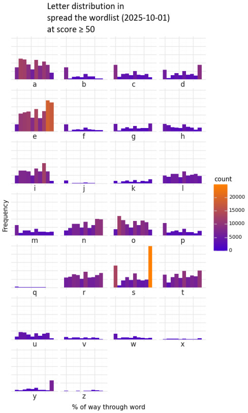

---
tags:
  - crossword
  - data analysis
  - wordlist
---

# Wordlist Distribution

## Overview

This graphic shows the distribution of letters for every word in [Spread the Wordlist](https://www.spreadthewordlist.com/) as of the 2025-10-01 release.

The distribution of letters in this graphic is intended to help inform crossword construction entry placement. It is easier to fill a grid if certain letters are placed toward the beginning or end of a given slot, and such distributions can be seen here.

Examples of letter positioning illuminated by this graphic include:

- Letters like B, C, F, and P offer more options when used at the beginning of a slot.
- Letters like D, S, and Y offer more options when used at the end of a slot (i.e. due to -ed, -s, and -y endings).
- Some letters almost never appear in certain slot positions, e.g. J, Q, or V in the last slot.
- Vowels + RSTLNE offer more fill options if those are your only constraints on a given slot.
- Overall, Scrabbly letters like J, Q, X, and Z are harder to find options for.

## Design notes

I was interested in finding the frequency distributions of letters in crossword entries to use as a reference point in entry and black square placement in a given crossword grid.

This is different from finding frequency distributions of letters in the English language. This is because crossword entries can contain:

- abbreviations
- expressions (e.g. YOU MAKE ME SICK)
- multiword terms (e.g. BLACK TEA)
- phrasal verbs (e.g. ACT UP)
- proper nouns

Additional information:

- Data source: [Spread the Wordlist](https://www.spreadthewordlist.com/) (2025-10-01 release)
- Data visualiaztion library: [Plotnine](https://plotnine.org/)
- Inspiration: [Frequency of letters in English words and where they occur in the word [OC]](https://redd.it/lowync/)
