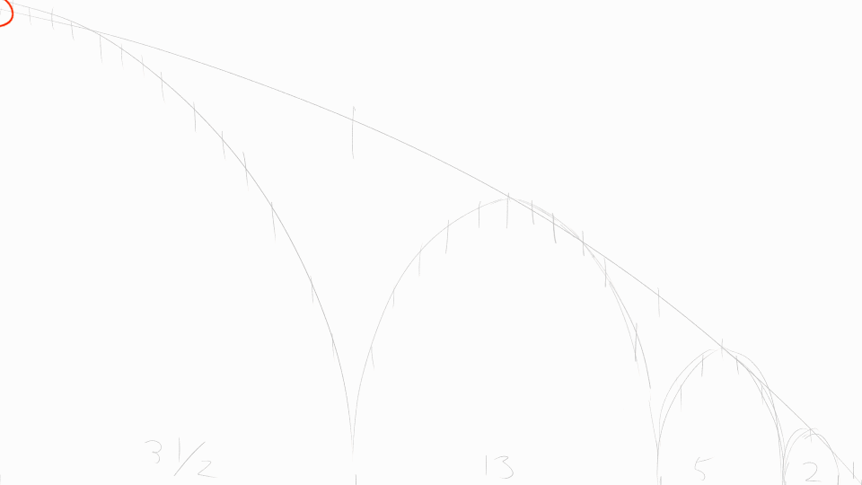
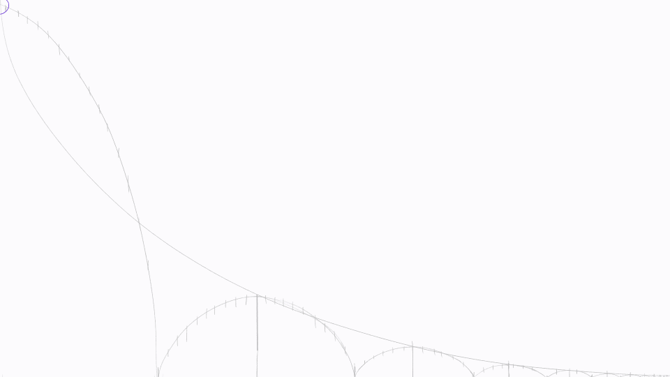
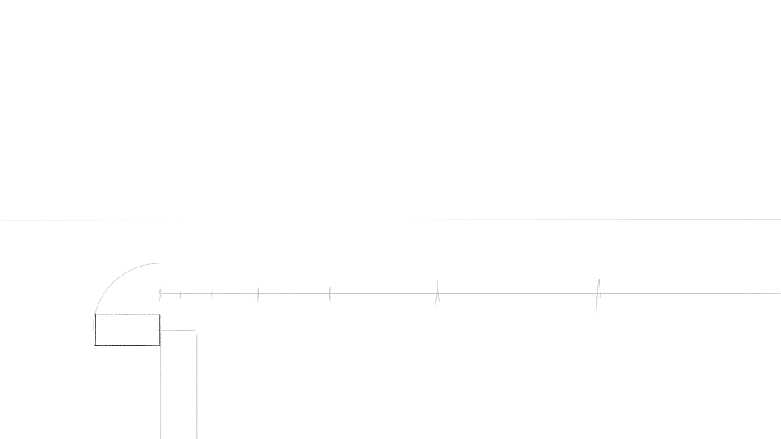
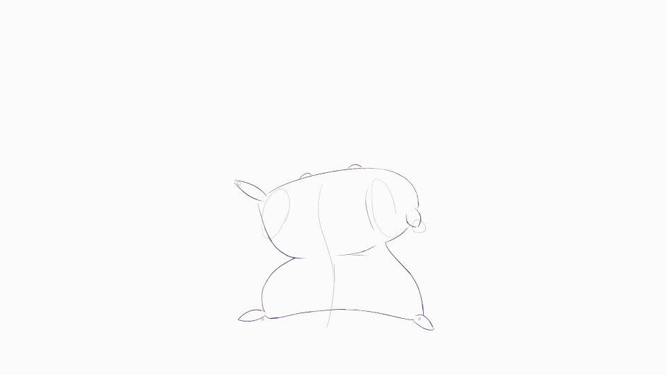

---
tags:
  - animation
  - bouncing ball
  - flour sack
  - flour sack animation
  - pluffle
---

# Animation Exercises

## Bouncing Ball (2025-08-11)

## Bouncing Ball Fibonacci (2025-08-13)

# Falling Brick (2025-08-14)

# Flour Sack Wave (2025-08-20 – 2025-08-21)

# Flour Sack Jump + Fall (2025-08-24)

## Overview

2D animation exercises.

## Design notes

- Software: Clip Studio Paint EX 4.0
- #8:
  - Inspired by the animation resources I'm following, I attempted to use smear frames.
  - Everything is an arc! I need to build up my animations from fundamentals instead of drawing each frame straight-head as the naive approach would be.
  - I learned much about how musculature works from drawing how a malleable mass shifts around.
- #9/#10:
  - I attempted to incorporate squash and stretch as the flour sack descended from the top of its arc.
  - While not on the exercise agenda, I practiced adding secondary motion.
  - I incorporated a few lines to act as a rudimentary background.
  - In contrast to a pivot-style approach, an [inverse kinematics](https://en.wikipedia.org/wiki/Inverse_kinematics)-style approach seems superior in producing convincing animation results.

## Resources used

- [51 Great Animation Exercises to Master](https://www.animatorisland.com/51-great-animation-exercises-to-master/)
- [Animation Secret: The Flour Sack](https://www.animatorisland.com/hello-world/)
- [Bouncing ball](https://en.wikipedia.org/wiki/Bouncing_ball)
- [How to Animate a Falling Brick - Animation Tutorial - 51 Animation Exercises](https://www.youtube.com/watch?v=lNzqbF0C6po)
- [How to animate a flour sack in 2D animation](https://www.youtube.com/watch?v=Qsgt8DVh558)
